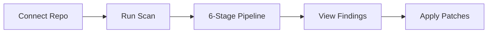
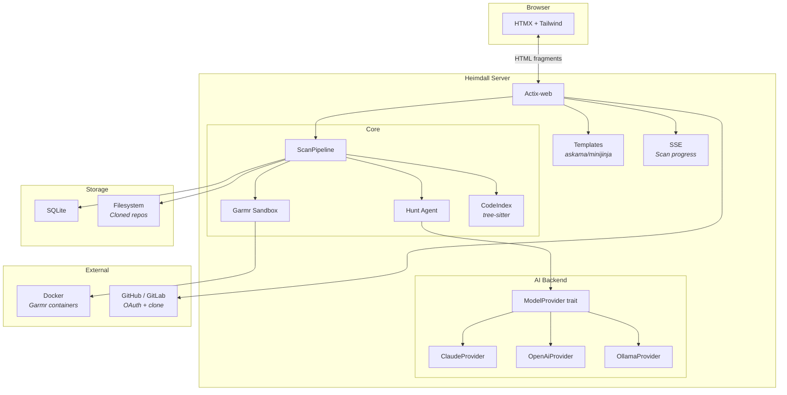
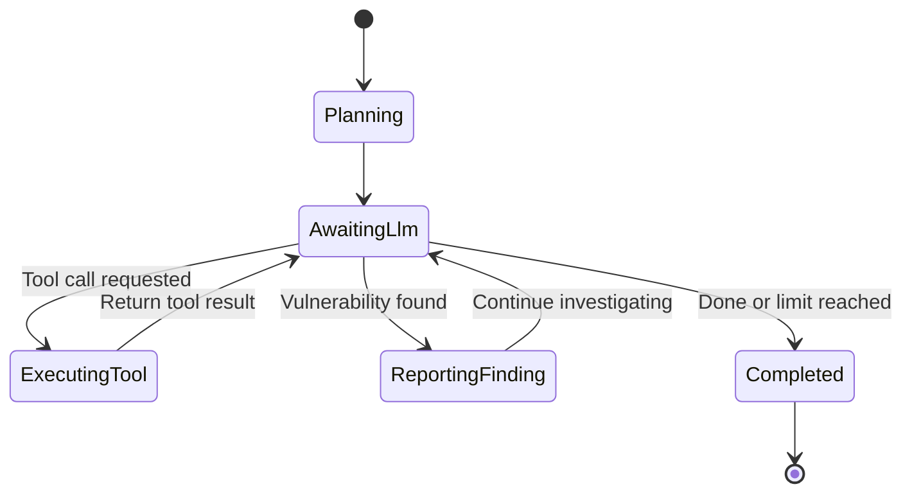
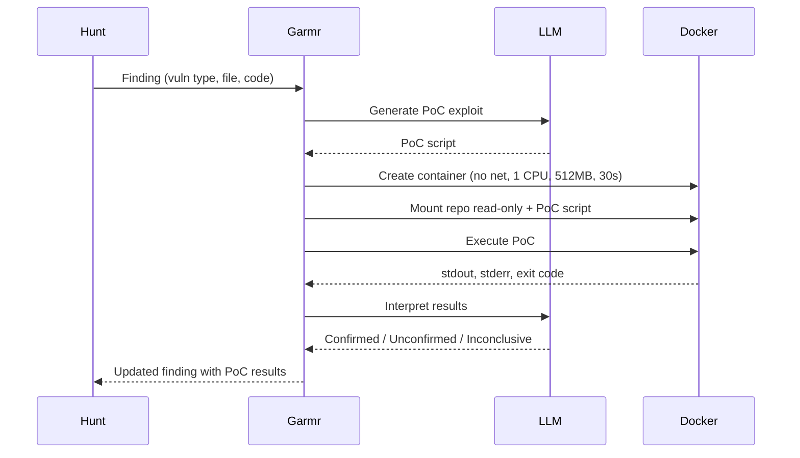
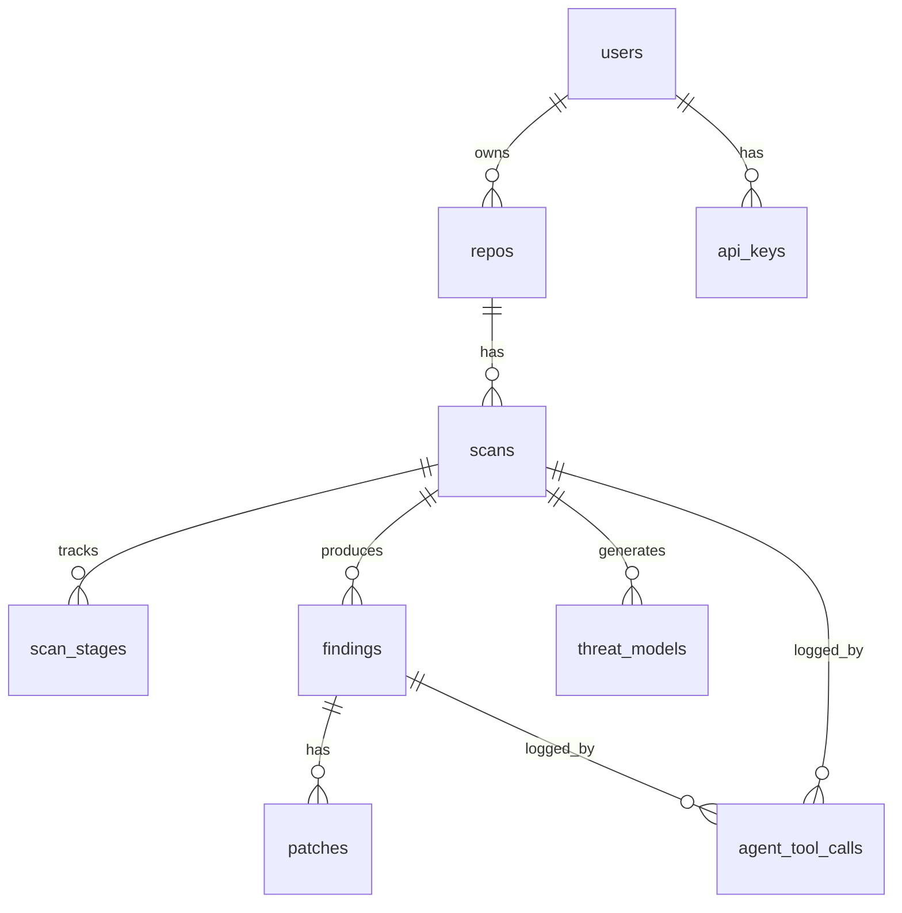

# Heimdall

**Agentic, context-aware security scanner for source code repositories.**

Heimdall goes beyond pattern matching: it builds a threat model of your application, deploys an AI agent that reasons about your codebase to discover real vulnerabilities, validates them in a sandboxed environment, and produces ranked findings with patches and proof-of-concept exploits.

## How It Works



1. **Connect a repository** — GitHub OAuth, GitLab OAuth, public git URL, or zip upload
2. **Run a scan** — manually triggered, the pipeline takes over
3. **Review findings** — severity-ranked, with code context, explanations, and patches
4. **Apply fixes** — accept suggested patches as unified diffs

## Scan Pipeline


### Stage Details

| Stage | Engine | Purpose | Speed |
|-------|--------|---------|-------|
| **Ingest** | tree-sitter | Clone repo, build code index (AST, symbols, call graph, data flows) | Seconds |
| **Tyr** | LLM | Generate structured threat model (boundaries, surfaces, data flows) | ~30s |
| **Static Analysis** | tree-sitter + regex | Deterministic pattern matching, secret detection, dependency audit | Seconds |
| **Hunt** | LLM Agent | Reason about code per-threat, discover real vulnerabilities | Minutes |
| **Garmr** | Docker + LLM | Execute PoC exploits in sandboxed containers to confirm findings | ~30s/finding |
| **Report** | LLM | Rank findings, generate patches as unified diffs, explain in plain English | ~30s |

## Architecture



## The Hunt Agent

The Hunt agent is an agentic loop — not a pattern matcher. It reasons about code the way a security researcher does.



**Available tools:**

| Tool | Purpose |
|------|---------|
| `read_file` | Read file contents |
| `search_code` | Regex search across codebase |
| `get_callers` | Find all call sites of a symbol |
| `get_dependencies` | Get dependency graph for a file |

Each threat/attack surface spawns a parallel investigation (via `tokio::spawn`). Max 25 LLM iterations per investigation.

## Garmr Sandbox



**Container constraints:** No network, 1 CPU, 512MB RAM, 30s timeout, non-root, repo mounted read-only.

## Findings

Each finding includes:

- **Severity** — Critical, High, Medium, Low
- **CWE/CVE** classification
- **File + line number** with code context
- **Plain English explanation** of the vulnerability
- **Suggested patch** as a unified diff
- **PoC exploit details** (if sandbox-validated)
- **Source badge** — AI (purple), Static (blue), Dependencies (green)

## Tech Stack

| Component | Technology |
|-----------|-----------|
| Language | Rust (2024 edition) |
| Web framework | Actix-web 4 |
| Frontend | HTMX + Tailwind CSS |
| Templates | askama / minijinja |
| Database | SQLite (→ Postgres) |
| AST parsing | tree-sitter (polyglot) |
| Docker SDK | bollard |
| AI providers | Claude, OpenAI, Ollama (BYOK) |
| Async runtime | Tokio |

## Data Model



## Project Structure

```
heimdall/
├── src/
│   ├── main.rs                 # Entry point
│   ├── config.rs               # Environment config
│   ├── state.rs                # AppState
│   ├── logging.rs              # Logger setup
│   ├── db/                     # Database operations
│   ├── models/                 # Domain models, API response, type aliases
│   ├── routes/                 # HTTP handlers (pages, API, fragments)
│   ├── middleware/             # Request context, auth
│   ├── pipeline/
│   │   ├── mod.rs              # ScanPipeline orchestrator
│   │   ├── ingest/             # Stage 1: Clone + AST indexing
│   │   ├── tyr/                # Stage 2: Threat modeling
│   │   ├── static_analysis/    # Stage 3: Pattern matching
│   │   ├── hunt/               # Stage 4: Agentic discovery
│   │   ├── garmr/              # Stage 5: Sandbox validation
│   │   └── report/             # Stage 6: Ranking + patches
│   ├── ai/                     # ModelProvider trait + implementations
│   ├── templates/              # HTML templates (base, pages, fragments)
│   └── utils/
├── docs/
│   ├── SPEC.md                 # Full product specification
│   ├── CODING_RULES.md         # Strict coding conventions
│   └── design.pen              # UI/UX designs
├── tests/                      # Integration tests
├── Cargo.toml
└── .gitignore
```

## Naming

| Name | Role |
|------|------|
| **Heimdall** | The product. The all-seeing guardian. |
| **Tyr** | Threat model engine. Norse god of justice. |
| **Garmr** | Sandbox validator. Hound guarding the gates of Hel. |

## AI Backend

Heimdall is model-agnostic via the `ModelProvider` trait:

```rust
#[async_trait]
pub trait ModelProvider: Send + Sync {
    async fn complete(&self, request: CompletionRequest) -> Result<CompletionResponse>;
}
```

**Supported providers:**
- **Claude** (Anthropic) — native tool_use format
- **OpenAI** — function calling format
- **Ollama** — local, no auth required

**BYOK:** Users bring their own API keys. Keys are encrypted at rest.

## License

[Functional Source License (FSL)](https://fsl.software/) — open and readable. Self-host with your own AI keys. Converts to fully open-source after a defined period. Commercial use requires a commercial license.

---

Built by [ModestNerd Co.](https://codecraftsolutions.co.za)
